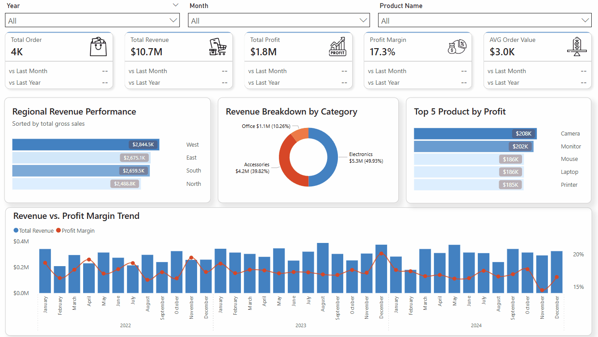
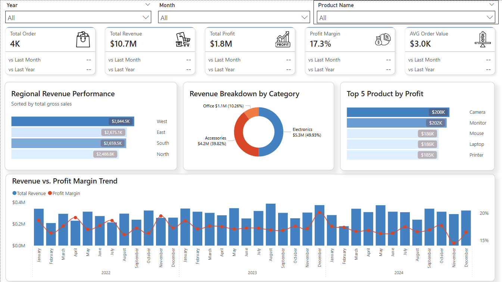
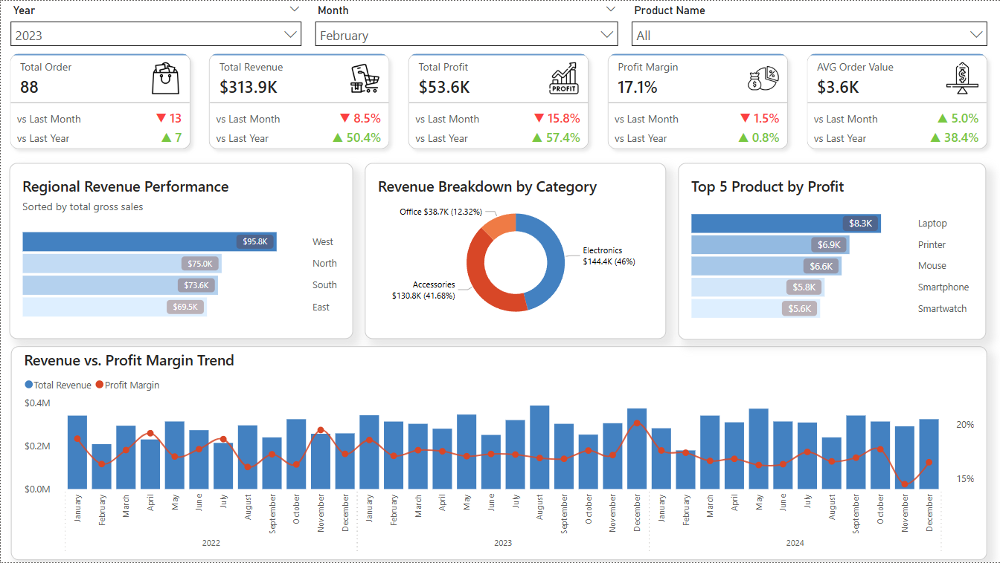

# E-Commerce Executive Scorecard & Profitability Analysis 📊

  
  <h4>Interactive Dashboard Demo</h4>
  
     
  
  <h4>Dashboard Default & Specialized View</h4>

## 📌 Project Overview
Business stakeholders frequently lack instant, reliable visibility into regional profitability and product performance, often relying on manual, static spreadsheets that delay critical decision-making. This project bridges that gap by providing a dynamic, automated executive scorecard.

By transforming raw sales and operational data into a clean, interactive visual tool built on a robust data model, this project enables executive teams to instantly identify revenue drivers, track profit margins, and make data-driven operational decisions at a glance.

## 💡 Key Business Insights
The dashboard provides immediate, high-level intelligence designed for quick consumption:
* **Profitability Tracking:** Delivers instant, drill-down visibility into **$1.8M in profit margins**, establishing a clear baseline for company health.
* **Top Revenue Drivers:** Instantly identifies top-performing product categories (e.g., Electronics) and isolates the specific geographic regions driving the highest net profit.
* **Macro vs. Micro Trends:** Features specific trend visualizations designed to maintain a macro-level business view, allowing executives to see overall performance even while drilling down into specific regional metrics.

## 🛠️ Tech Stack & Methodologies
* **Data Architecture:** Star Schema Modeling (Fact & Dimension Tables)
* **Business Intelligence:** Power BI
* **Calculations:** Advanced DAX (Time-intelligence, conditional formatting, dynamic rendering)
* **Design Principles:** Executive Scorecard Layout, Cognitive Load Reduction, Selective Cross-Filtering

## ⚙️ Development Process

### 1. Data Modeling & Architecture
* Structured the raw e-commerce data into a highly efficient **Star Schema**, creating distinct dimension tables (Dates, Products, Regions) and fact tables (Sales, Orders) to ensure optimal dashboard performance and rapid filtering.

### 2. Advanced DAX & Interaction Logic
* Authored custom time-intelligence DAX measures to automatically calculate and track Month-over-Month (MoM) growth.
* Implemented advanced UI logic to reduce executive cognitive load: when a slicer is set to 'All', associated comparative data cards intentionally render as blank rather than displaying a confusing, aggregated reference value.
* Configured selective visual interactions, ensuring that certain macro-trend graphs remain fully independent and do not connect to specific slicers, preserving the overarching business context during deep-dives.

### 3. UI/UX & Dashboard Design
* **Clean, Professional Aesthetics:** Designed a modern, light-themed interface utilizing a dark blue and grey corporate color palette to convey trust and professionalism.
* **Strategic Visual Hierarchy:** Placed high-level KPI cards (Total Sales, Profit Margin, AOV) at the very top for immediate consumption, funneling down into more granular regional and category breakdowns.

## 🚀 How to Interact with the Dashboard
1. Download the `.pbix` file from this repository.
2. Open the file using Power BI Desktop.
3. Utilize the category and date slicers to dynamically filter the report, and observe how the independent trend lines maintain macro-visibility while the KPI cards calculate exact micro-metrics.
